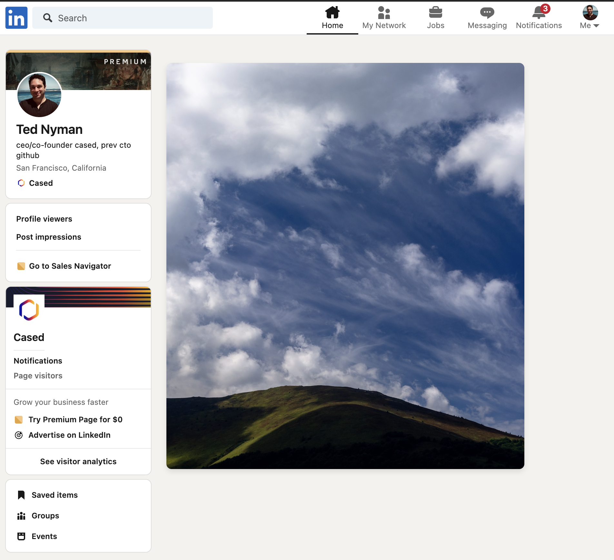

# zenfeed

Remove and replace your LinkedIn feed with relaxing images.

There are five default images, but you can switch them out for your own images,
maybe cats or something I dunno, whatever you'd like.

## Features

- Hides the news feed
- Replaces the feed with one of five randomly selected images

## Installation

It's not curently on the Chrome Web Store, but you can install it yourself easily.

To install this extension directly from GitHub:

1. **Clone or download this repository**
   - Make sure you have git installed, then run:
     ```
     git clone https://github.com/tnm/zenfeed.git
     ```

     and take note of the directory it's in.

2. **Load the extension in Chrome**
   - Open Google Chrome and navigate to `chrome://extensions/`
   - Enable "Developer mode" by toggling the switch in the top right corner
   - Click on "Load unpacked" on the left side of the page
   - Select the directory containing this repo and its extension files (manifest.json, content.js, styles.css, and the image files)

3. **Verify installation**
   - You should see the Zenfeed extension in your list of installed extensions
   - Visit LinkedIn to see the extension in action

## Usage

Once installed, just browse LinkedIn as usual. The extension will automatically hide the news feed and replace it with a randomly selected image. The image will change each time you refresh the page or navigate to a different LinkedIn page.



## Customization

To use your own images:
1. Replace the image-1.jpg through image-5.jpg files with your preferred images
2. Make sure to keep the same file names
3. Reload the extension in the Chrome extensions page

## Troubleshooting

If the extension doesn't work as expected:
1. Make sure all files are in the correct location
2. Check that you've enabled the extension in Chrome
3. Try refreshing the LinkedIn page
4. If issues persist, try uninstalling and reinstalling the extension

## Contributing

Contributions are welcome! Please feel free to submit a Pull Request.

## License

This project is licensed under the MIT License - see the LICENSE file for details.

## Disclaimer

This extension is not affiliated with, endorsed by, or sponsored by LinkedIn. Use at your own discretion.